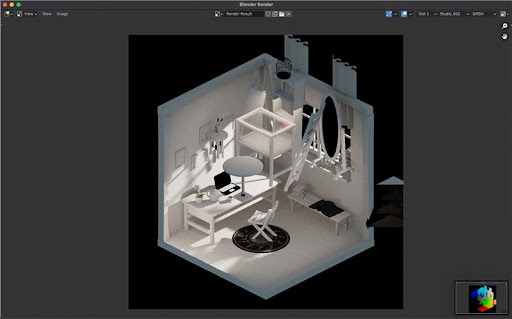
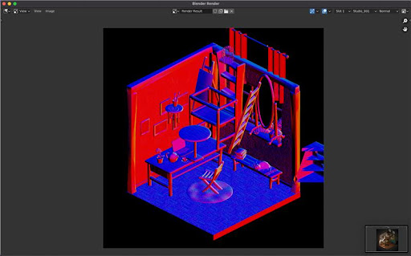
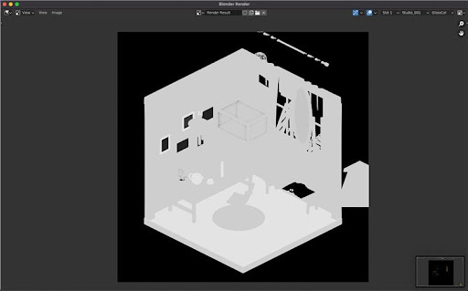
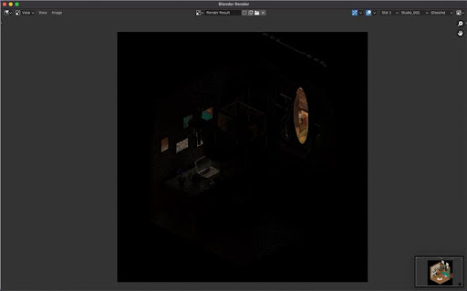
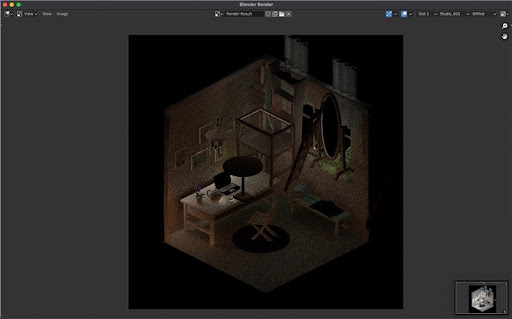

BPYCV3D
=======

Package available on PyPI: 

Please find a more detailed documentation at: 

**BPYCV3D** is a blender python library that allows you to extract data from blender for 3d models training purposes.

There is also a UI component provided with the library.

We provide multiple components to work with - Basic Data Capture with pre-defined Camera, Camera Path added to the data capture so one can get images of a scene from multiple angles which is important for 3d related work. Further, one can also get custom lighting details using our custom data extraction pipeline. For more information on this, please refer to the API reference.

Some Results of the Library/Plugin
----------------------------------
| | | | |
|:-------------------------:|:-------------------------:|:-------------------------:|:-------------------------:|
|||||
|||||
