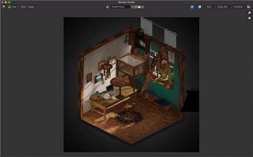

.. BPYCV3D documentation master file, created by
   sphinx-quickstart on Thu Dec  1 02:30:09 2022.
   You can adapt this file completely to your liking, but it should at least
   contain the root `toctree` directive.

Welcome to BPYCV3D documentation!
=================================

**BPYCV3D** is a blender python library that allows you to extract data from blender for 3d models training purposes.

There is also a UI component provided with the library, that allows you to run the extraction process without writing a single line of code.

We provide multiple components to work with - Basic Data Capture with pre-defined Camera, Camera Path added to the data capture so one can get images of a scene from multiple angles which is important for 3d related work. Further, one can also get custom lighting details using our custom data extraction pipeline. For more information on this, please refer to the API reference.

Sample Images of different channels of a scene
----------------------------------------------
.. image:: images/channel_1.jpg
   :width: 24%

.. image:: images/channel_3.jpg
   :width: 24%
.. image:: images/channel_4.jpg
   :width: 24%
.. image:: images/channel_5.jpg
   :width: 24%

.. image:: images/channel_7.jpg
   :width: 24%
.. image:: images/channel_8.jpg
   :width: 24%

Documentation Sitemap
---------------------
.. toctree::
   installation
   getting_started
   plugin
   api_reference
