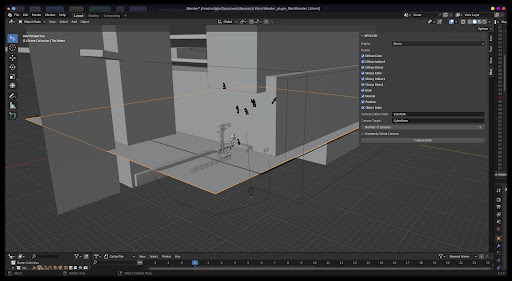
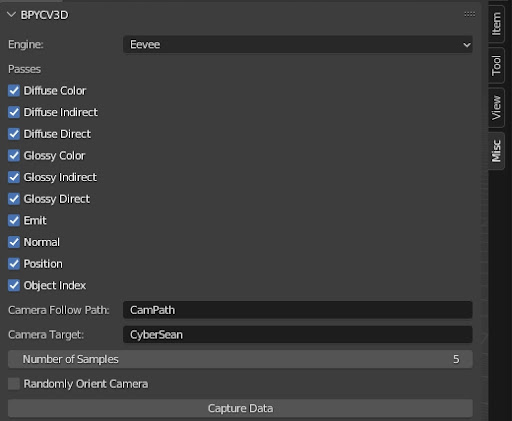

Plugin UI
=========

For Plugin Installation please follow :ref:`plugin-installation-ref`.

Post Installation the plugin would appear at right sidebar of the viewport.

The Plugin UI has the following parameters. Please refer to the :doc:`api_reference` for further information.

